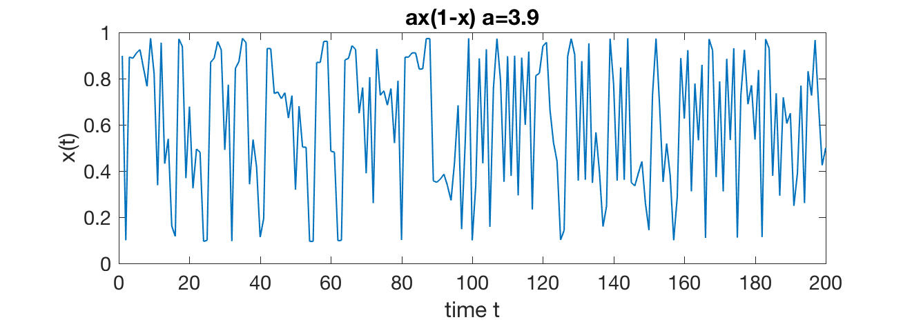

# LogisticMap
This modules add a logistic map activation function for torch nn module. This is useful for setup chaotic RNN networks as a teacher model. The form of the function is: 
 
 y = ax(1-x) 
  
  where a is the gain of the map. Here is a sample run from the test script: 
  
  
